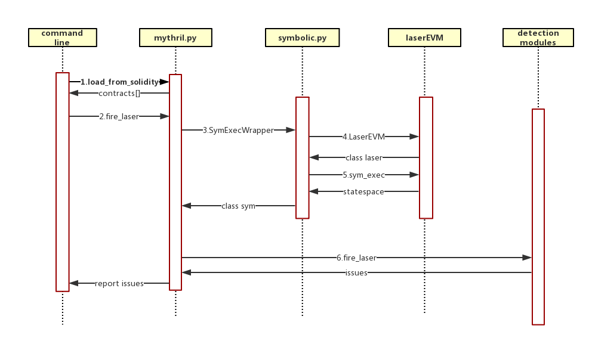

# Mythril Mechanism Analysis

### Introduction

Mythril is a security analysis tool for Ethereum smart contracts. This documentation focuses on the mechanism of Mythril, including source code analysis and concolic execution analysis. I hope to have a deeper understanding of Mythril.

Mythril is based on python and consists of two main parts, namely LaserEVM and Mythril. The reminder of this document is structured as follows: I provide main structure and several main functions of Mythril in Section I and analyze the source code and operating methods of LaserEVM in Section II. Finally, I introduce the concolic execution of Mythril and provide an example in Section III.


## Section I: Main Structure

Considering that Mythril can implement multiple functions through different commands, I utilize one kind of command as an example to analyze the processing procedure. The command is "myth -x contract.sol" used to detect the contract vulnerability.

The process is as shown in the picture below:



### Command Line

Command line interface : mythril.interface.cli.py 

Cli.py mainly analyzes the input of the command line and passes it to mythril. For our example, the command line mainly calls two functions of mythril.

```python
//code line 163: interface with loading the contract from solidity file
address, _ = mythril.load_from_solidity(args.solidity_file)
```

```python
//code line 199: interface with invoking Mythril.py
report = mythril.fire_lasers(address=address,
    modules=[m.strip() for m in args.modules.strip().split(",")] if args.modules else [],
    verbose_report=args.verbose_report,
    max_depth=args.max_depth)
```

The first function is used to load the contract from solidity file. The return value are an array containing contracts and address. The second function passes related parameters to start laser.

### Mythril.py

Mythril interface: mythril.mythril.py

```python
//code line 320: interface with cli.py
def fire_lasers(self, strategy, contracts=None, address=None,
                modules=None,
                verbose_report=False, max_depth=None, execution_timeout=None, ):
    all_issues = []
    if self.dynld and self.eth is None:
        self.set_api_rpc_infura()
    for contract in (contracts or self.contracts):
        //code line 329: interface with symbolic.py
        sym = SymExecWrapper(contract, address, strategy,
                             dynloader=DynLoader(self.eth) if self.dynld else None,
                             max_depth=max_depth, execution_timeout=execution_timeout)
        //code line 333: interface with detection
        issues = fire_lasers(sym, modules)
```

Mythril creates an object called ```sym``` for each contract. ```SymExc``` represents symbolic execution. Mythril.py calls a class in symbolic.py and generate an object which is utilized to detect vulnerabilities in the last line.

### Symbolic.py

Symbolic interface: mythril.analysis.symbolic.py

```python
class SymExecWrapper:

    '''
    Wrapper class for the LASER Symbolic virtual machine. Symbolically executes the code and does a bit of pre-analysis for convenience.
    '''

    def __init__(self, contract, address, dynloader=None, max_depth=12):

        account = svm.Account(address, contract.disassembly, contract_name=contract.name)

        self.accounts = {address: account}

        self.laser = svm.LaserEVM(self.accounts, dynamic_loader=dynloader, max_depth=max_depth)

        self.laser.sym_exec(address)

        self.nodes = self.laser.nodes
        self.edges = self.laser.edges
```

We can easily understand the role of this class through the comment. SymExecWrapper is utilized for LASER Symbolic Execution. It creates an object based on LaserEVM.

```python
self.laser = svm.LaserEVM(self.accounts, dynamic_loader=dynloader, max_depth=max_depth)
```

Then it calls a function called sym_exec to start concolic execution. The return values are nodes and edges which makes up the statespace.

### LaserEVM

LaserEVM interface: laser.ethereum.svm.py

```python
'''
Main symbolic execution engine.
'''


class LaserEVM:

    def __init__(self, accounts, dynamic_loader=None, max_depth=12):
        self.accounts = accounts
        self.nodes = {}
        self.edges = []
        self.current_func = ""
        self.call_stack = []
        self.pending_returns = {}
        self.total_states = 0
        self.dynamic_loader = dynamic_loader
        self.max_depth = max_depth

        logging.info("LASER EVM initialized with dynamic loader: " + str(dynamic_loader)) 
```

```python
def sym_exec(self, main_address):
    logging.debug("Starting LASER execution")

    # Initialize the execution environment

    environment = Environment(
        self.accounts[main_address],
        BitVec("caller", 256),
        [],
        BitVec("gasprice", 256),
        BitVec("callvalue", 256),
        BitVec("origin", 256),
        calldata_type=CalldataType.SYMBOLIC,
    )

    gblState = GlobalState(self.accounts, environment)

    node = self._sym_exec(gblState)
    self.nodes[node.uid] = node
    logging.info("Execution complete")
    logging.info("%d nodes, %d edges, %d total states", len(self.nodes), len(self.edges), self.total_states)
```

This section will be described in detail in the next section. We can find it's the main process of generating statespace including nodes, edges and others.

### Detection

Detection interface: mythril.analysis.modules.

It includes many templates such as delegatecall.py and integer.py. These are templates for detecting vulnerabilities. They complete the preparation for constraints which is what z3 needs. Finally, z3 solver completes the detection according to the constraints provided by mythril.


## Section II: LaserEVM Analysis

### Initialize globalstate

It starts with symbolic.py calling class LaserEVM to create a laser object. Then it calls a function called sym_exec to start concolic execution. 

```python
def sym_exec(self, main_address):
    logging.debug("Starting LASER execution")

    # Initialize the execution environment

    environment = Environment(
        self.accounts[main_address],
        BitVec("caller", 256),
        [],
        BitVec("gasprice", 256),
        BitVec("callvalue", 256),
        BitVec("origin", 256),
        calldata_type=CalldataType.SYMBOLIC,
    )

    gblState = GlobalState(self.accounts, environment)

    node = self._sym_exec(gblState)
    self.nodes[node.uid] = node
    logging.info("Execution complete")
    logging.info("%d nodes, %d edges, %d total states", len(self.nodes), len(self.edges), self.total_states)
```

We know there are several important concepts that are World State, Machine State and Environment respectively. As we can see, it initialize the environment in the first place. BitVec produces a symbolic variable. The first argument to BitVec is a name. The name could be a string or integer. When you pass a string, Z3 creates an internal symbol named the string. So LaserEVM initializes some of the variables in the environment as symbols.

Laser also proposes a new variable called globalstate that includes world state, machine state and environment. After completing the environment, laser initializes the globalstate.

```gblState = GlobalState(self.accounts, environment)```

```python
class GlobalState():

    def __init__(self, accounts, environment, machinestate=MachineState(gas=10000000)):
        self.accounts = accounts
        self.environment = environment
        self.mstate = machinestate
```

We can find the environment passed directly as a parameter because it was initialized before. Machine state initialization requires one parameter called gas. The value of gas is fixed. The stack and others are initially empty as shown below.

```python
class MachineState():

    def __init__(self, gas):
        self.pc = 0
        self.stack = []
        self.memory = []
        self.memsize = 0
        self.gas = gas
        self.constraints = []
        self.depth = 0
```

The initialization of worldstate was completed at the beginning of the call to call SymExcWrapper. As we can see, account including worldstate passes as parameter to LaserEVM. 

```python
        account = svm.Account(address, contract.disassembly, contract_name=contract.name)

        self.accounts = {address: account}

        self.laser = svm.LaserEVM(self.accounts, dynamic_loader=dynloader, max_depth=max_depth)
```

To this end, the globalstate initialization is finished. Then it starts the execution cycle.

### Generate nodes and edges

If you have read the paper of Mythril, it's obvious that Laser organizes program states via a control flow graph. Graph consists of edges and nodes. The goal here is to get the states of each instruction in each node after execution.

Basically, generate nodes and edges based on initialized globalstate. The first variable, environment, is assigned to the globalstate created in the previous step. Disassembly is the contract code and state is the machine state of globalstate. The variable node is created by the class Node.

```python
node = self._sym_exec(gblState)
```

```python
def _sym_exec(self, gblState):
    environment = gblState.environment
    disassembly = environment.code
    state = gblState.mstate

    start_addr = disassembly.instruction_list[state.pc]['address']

    node = Node(environment.active_account.contract_name, start_addr, copy.deepcopy(state.constraints))
```

First, get the instruction, assign it to the variable called instr. Then save states before modifying anything. It appends globalstate to the states array for each node. Next, start the opcode execution processing. After executing an  instruction, variable state.pc plus one. It can be found that the program utilizes if and elif to discriminate each instruction, and then change the states of nodes . As long as halt = false, it will continue to process and continue to append the new globalstate to the node.states array. The resulting nodes and edges are passed to the function that called Laser.

```python
halt = False

        while not halt:

            try:
                instr = disassembly.instruction_list[state.pc]
            except IndexError:
                logging.debug("Invalid PC")
                return node

            # Save state before modifying anything

            node.states.append(gblState)
            gblState = LaserEVM.copy_global_state(gblState)

            state = gblState.mstate

            self.total_states += 1

            # Point program counter to next instruction

            state.pc += 1
            op = instr['opcode']

            # logging.debug("[" + environment.active_account.contract_name + "] " + helper.get_trace_line(instr, state))
            # slows down execution significantly.

            # Stack ops

            if op.startswith("PUSH"):
                value = BitVecVal(int(instr['argument'][2:], 16), 256)
                state.stack.append(value)
            elif
            elif
            elif
            ...
```

### Jump

The nodes appear as arrays in the laser. The variable called uid starts at 0. Each node has a plus. Edges utilize uid to represent from one node to another. When It meets  some instructions like JUMP, procedure generates a new node and generate an edge, and then set the halt to true, current node's operation is terminated after recursion. 

We take the JUMPDEST instruction as an example and see how the process  occurs.

```python
if opcode == "JUMPDEST":

    new_gblState = LaserEVM.copy_global_state(gblState)
    new_gblState.mstate.pc = i
    new_gblState.mstate.depth += 1

    new_node = self._sym_exec(new_gblState)
    self.nodes[new_node.uid] = new_node

    self.edges.append(Edge(node.uid, new_node.uid, JumpType.UNCONDITIONAL))
    halt = True
    continue
```

First, we need to copy the previous globalstate because program executes globalstate to generate new nodes. Then we go to the next loop and start executing instructions just like the first loop we demonstrate.

```python
new_node = self._sym_exec(new_gblState)
    self.nodes[new_node.uid] = new_node
```

Current node's operation is terminated after recursion. In addition, it will also generate an edge. Because "JUMPDEST" instruction is unconditional, fork doesn't exist. So far we have got a completed node and came to the next loop.

 ### Fork

In some cases, nodes fork to generate two new nodes. For example, when we meet some instructions like JUMPI, nodes will fork because that is conditional JUMP. Besides, there will be two conditional edges. Here we pay attention to the fork part, the processing data will be mentioned in Section III.

Let's take the JUMPI instruction as an example and see how the fork occurs.

```python
elif (type(condition) == BoolRef):

    if not is_false(simplify(condition)):
        # Create new node for condition == True
    
        new_gblState = LaserEVM.copy_global_state(gblState)
        new_gblState.mstate.pc = i
        new_gblState.mstate.constraints.append(condition)
        new_gblState.mstate.depth += 1
    
        new_node = self._sym_exec(new_gblState)
        self.nodes[new_node.uid] = new_node
        self.edges.append(Edge(node.uid, new_node.uid, JumpType.CONDITIONAL, condition))
```

```python
new_gblState = LaserEVM.copy_global_state(gblState)

    if (type(condition) == BoolRef):
        negated = Not(condition)
    else:
        negated = condition == 0

    if not is_false(simplify(negated)):

        new_gblState.mstate.constraints.append(negated)

        new_node = self._sym_exec(new_gblState)
        self.nodes[new_node.uid] = new_node
        self.edges.append(Edge(node.uid, new_node.uid, JumpType.CONDITIONAL, negated))

    halt = True
```

The above two parts are the code to generate two new nodes for condition == true and condition == false respectively. Obviously, this part is highly similar to direct jump instruction besides it has another parameter called constraints and  conditional edge. After fork, there are two loops to process two nodes separately. Finally, we will get two nodes connected to previous node.

### Return value

When we finish every single instruction, what do we get? As described above, it's clear that we have states related to every instruction. Because of the edges and constraints, we can figure out how we can reach a certain node, however the detailed process is completed by z3 solver which we don't delve into. To this end, we have this statespace that is utilized in detecting vulnerabilities later.  

### Detect vulnerabilities

Let's go back to mythril.py in Section I. So far we have finished SymExecWrapper and got the statespace called sym. Then we execute the following code:

```issues = fire_lasers(sym, modules)```

It calls to mythril.analysis.security.py and returns the issues which the contract might have to mythril.py.

```python
def fire_lasers(statespace, module_names=None):

    issues = []
    _modules = []

    for loader, name, is_pkg in pkgutil.walk_packages(modules.__path__):
        _modules.append(loader.find_module(name).load_module(name))

    logging.info("Starting analysis")

    for module in _modules:
        if not module_names or module.__name__ in module_names:
            logging.info("Executing " + str(module))
            issues += module.execute(statespace)

    return issues
```

Since there are some modules we can utilize, Let's take the integer flow module as an example.

Module interface: mythril.mythril.analysis.modules.integer.py

```python
def execute(statespace):
    """
    Executes analysis module for integer underflow and integer overflow
    :param statespace: Statespace to analyse
    :return: Found issues
    """
    logging.debug("Executing module: INTEGER")

    issues = []

    for k in statespace.nodes:
        node = statespace.nodes[k]

        for state in node.states:
            issues += _check_integer_underflow(statespace, state, node)
            issues += _check_integer_overflow(statespace, state, node)

    return issues
```

As demonstrated above, we can find mythril check every state in every node. Here is a double loop to accomplish this work. 

```python
def _check_integer_overflow(statespace, state, node):
    """
    Checks for integer overflow
    :param statespace: statespace that is being examined
    :param state: state from node to examine
    :param node: node to examine
    :return: found issue
    """
    issues = []
```

There are several major steps in the detection of integer flow. I don’t show detailed code here and this part will be highlighted in Section III. The steps are checking the instruction, formulating overflow constraints, type check, changing type, formulating expression, checking satisfiable, building issues respectively.

After that, return issues to mythril.py and mythril.py returns report to command line. Finally, we can see the vulnerabilities mythril detected. That's the answer.


## Section III: Symbolic Execution

As described above, we can figure out the general process of Mythril. However, we haven't known the data flow and how the symbolic variables work. More specifically, we need to get an insight to the stack.

Let's have a look at this example which I found at Ethereum wiki. https://github.com/ethereum/wiki/wiki/Ethereum-Development-Tutorial

There is a set of opcodes of a smart contract:

```opcode
PUSH1 0 CALLDATALOAD SLOAD NOT PUSH1 9 JUMPI STOP JUMPDEST PUSH1 32 CALLDATALOAD PUSH1 0 CALLDATALOAD SSTORE
```

The purpose of this particular contract is to serve as a name registry; anyone can send a message containing 64 bytes of data, 32 for the key and 32 for the value. The contract checks if the key has already been registered in storage, and if it has not been then the contract registers the value at that key.

During execution, an infinitely expandable byte-array called "memory", the "program counter" pointing to the current instruction, and a stack of 32-byte values is maintained. At the start of execution, memory and stack are empty and the PC is zero. Now, let us suppose the contract with this code is being accessed for the first time, and a message is sent in with 123 wei (1018wei = 1 ether) and 64 bytes of data where the first 32 bytes encode the number 54 and the second 32 bytes encode the number 2020202020.

Now, Let's see how Mythril processes there opcodes.

### 1.`PUSH1 0`

The instruction at position 0 is PUSH1, which pushes a one-byte value onto the stack and jumps two steps in the code. Thus, we have:

```opcode
PC: 2 STACK: [0] MEM: [], STORAGE: {}
```

#### Mythril source code:

```python
if op.startswith("PUSH"):
    value = BitVecVal(int(instr['argument'][2:], 16), 256)
    state.stack.append(value)
```

Overall Laser finishes this instruction by creating a bit-vector constant and appending it to stack. ```instr['argument'][2:]``` represents the argument of this instruction from position 2 to the end. Since ```PUSH1 0``` has the argument 1/space/0, so the value of this constant is 0. To this end, we push a BitVecval onto the stack.

### 2.`CALLDATALOAD`

The instruction at position 2 is CALLDATALOAD, which pops one value from the stack, loads the 32 bytes of message data starting from that index, and pushes that on to the stack. Recall that the first 32 bytes here encode 54.

```opcode
PC: 3 STACK: [54] MEM: [], STORAGE: {}
```

#### Mthril source code:

```python
elif op == 'CALLDATALOAD':
    # unpack 32 bytes from calldata into a word and put it on the stack

    op0 = state.stack.pop()

    try:
        offset = helper.get_concrete_int(simplify(op0))
        b = environment.calldata[offset]

    except AttributeError:
        logging.debug("CALLDATALOAD: Unsupported symbolic index")
        state.stack.append(BitVec("calldata_" + str(environment.active_account.contract_name) + "_" + str(op0), 256))
        continue
    except IndexError:
        logging.debug("Calldata not set, using symbolic variable instead")
        state.stack.append(BitVec("calldata_" + str(environment.active_account.contract_name) + "_" + str(op0), 256))
        continue

    if type(b) == int:

        val = b''

        try:
            for i in range(offset, offset + 32):
                val += environment.calldata[i].to_bytes(1, byteorder='big')

            logging.debug("Final value: " + str(int.from_bytes(val, byteorder='big')))
            state.stack.append(BitVecVal(int.from_bytes(val, byteorder='big'), 256))

        except:
                        state.stack.append(BitVec("calldata_" + str(environment.active_account.contract_name) + "_" + str(op0), 256))
    else:
        # symbolic variable
        state.stack.append(BitVec("calldata_" + str(environment.active_account.contract_name) + "_" + str(op0), 256))
```

First, we pop a value from stack. Obviously, the value is the BitVecval that we pushed just now. Then we transform this value to type int by using the function  called get_concrete_int and assign it to variable called offset. Next is the key line of code: ```b = environment.calldata[offset]```. But what is the ```environment.calldata```?  Let's see this:

```python
environment = Environment(
    self.accounts[main_address],
    BitVec("caller", 256),
    [],
    BitVec("gasprice", 256),
    BitVec("callvalue", 256),
    BitVec("origin", 256),
    calldata_type=CalldataType.SYMBOLIC,
)
```

We can see from above that ```Calldata``` belongs to the third argument of ```enviroment```:```[],``` . Since we have not assign anything to it yet, ```environment.calldata``` is still empty. Combined with the source code, It's clear that we come to this result: ```state.stack.append(BitVec("calldata_" + str(environment.active_account.contract_name) + "_" + str(op0), 256))```.

By the way, BitVec produces a symbolic variable. The first argument to BitVec is the name of this symbol. So we creates a symbol called "calldata_contract_name_op0" and appends it to stack.

Here comes to the concept of symbolic execution. Since Mythril is a simulation of contract execution, we have no real input to be assigned to the variables such as calldata. So we utilize symbols to replace input data. 

### 3.`SLOAD`

SLOAD pops one from the stack and checks if there is a value in storage for the key popped from the stack. If so, it pushes the value into the stack at the current index. Since the contract is used for the first time, the storage is empty and no value is found for the popped key. Therefore, SLOAD pushes zero to the stack.

```opcode
PC: 4 STACK: [0] MEM: [], STORAGE: {}
```

#### Mythril source code:

```python
elif op == 'SLOAD':
    index = state.stack.pop()
    logging.debug("Storage access at index " + str(index))

    try:
        index = helper.get_concrete_int(index)
    except AttributeError:
        index = str(index)

    try:
        data = gblState.environment.active_account.storage[index]
    except KeyError:
        data = BitVec("storage_" + str(index), 256)
        gblState.environment.active_account.storage[index] = data

    state.stack.append(data)
```

First, we pop the value ```calldata_Contract_name_op0``` we pushed to stack just now. In the first ```try```, because index is a symbol, it will cause except which convert index to a string. In the second ```try```, because index is a string, it will also cause except which creates a symbol named "storage_index" and finally appends it to stack. These is a difference from the implementation of this contract that we didn't push the value of storage or zero to stack because we can't make the predicate if the value poped exists in storage based on symbol.

### 4.`NOT`

NOT pops one value and pushes 1 if the value is zero, else 0

```opcode
PC: 5 STACK: [1] MEM: [], STORAGE: {}
```

#### Mythril source code:

```python
elif op == 'NOT':
    state.stack.append(TT256M1 - state.stack.pop())
```

```TT256M1``` is a global variable equal to 2 ** 256 - 1. Now we pop the symbol named storage_index and appends expression ```TTT256M1 - storage_index```.

### 5.`PUSH1 9`

Just like the first instruction, we push a one-byte value onto stack.

```opcode
PC: 7 STACK: [1, 9] MEM: [], STORAGE: {}
```

### 6.`JUMPI`

The JUMPI instruction pops 2 values and jumps to the instruction designated by the first only if the second is nonzero. Here, the second is nonzero, so we jump. If the value in storage index 54 had not been zero, then the second value from top on the stack would have been 0 (due to NOT), so we would not have jumped, and we would have advanced to the STOP instruction which would have led to us stopping execution.

```opcode
PC: 9 STACK: [] MEM: [], STORAGE: {}
```

#### Mythril source code:

```python
elif op == 'JUMPI':
    op0, condition = state.stack.pop(), state.stack.pop()

    try:
        jump_addr = helper.get_concrete_int(op0)
    except:
        logging.debug("Skipping JUMPI to invalid destination.")

    if (state.depth < self.max_depth):

        i = helper.get_instruction_index(disassembly.instruction_list, jump_addr)

        if not i:
            logging.debug("Invalid jump destination: " + str(jump_addr))

        else:
            instr = disassembly.instruction_list[i]

            if instr['opcode'] != "JUMPDEST":
                logging.debug("Invalid jump destination: " + str(jump_addr))
                halt = True
                continue

            elif (type(condition) == BoolRef):

                if not is_false(simplify(condition)):

                    # Create new node for condition == True

                    new_gblState = LaserEVM.copy_global_state(gblState)
                    new_gblState.mstate.pc = i
                    new_gblState.mstate.constraints.append(condition)
                    new_gblState.mstate.depth += 1

                    new_node = self._sym_exec(new_gblState)
                    self.nodes[new_node.uid] = new_node
                    self.edges.append(Edge(node.uid, new_node.uid, JumpType.CONDITIONAL, condition))

                else:
                    logging.debug("Pruned unreachable states.")

            else:
                logging.debug("Invalid condition: " + str(condition) + "(type " + str(type(condition)) + ")")
                halt = True
                continue

            new_gblState = LaserEVM.copy_global_state(gblState)

            if (type(condition) == BoolRef):
                negated = Not(condition)
            else:
                negated = condition == 0

            if not is_false(simplify(negated)):

                new_gblState.mstate.constraints.append(negated)

                new_node = self._sym_exec(new_gblState)
                self.nodes[new_node.uid] = new_node
                self.edges.append(Edge(node.uid, new_node.uid, JumpType.CONDITIONAL, negated))

            halt = True
            # continue

    else:
        logging.debug("Max depth reached, skipping JUMPI")
```

Obviously, the second line `op0, condition = state.stack.pop(), state.stack.pop()` pops two value from stack. op0 is the value we pushed last step, so it equals to 9.  Condition is the value we pushed when we met the instruction SLOAD, it equals to 2 ** 256 - 1 - storage_calldata_Contract_name_op0.

### 7. Integer template

The following instructions are similar to those in the previous steps. Now let's see how Mythril uses these symbols in detecting vulnerabilities. We utilize integer overflow as a template.

Mythril source code: Part of integer.py

```python
# Check the instruction
instruction = state.get_current_instruction()
if instruction['opcode'] not in ("ADD", "MUL"):
    return issues

# Formulate overflow constraints
stack = state.mstate.stack
op0, op1 = stack[-1], stack[-2]

# An integer overflow is possible if op0 + op1 or op0 * op1 > MAX_UINT
# Do a type check
allowed_types = [int, BitVecRef, BitVecNumRef]
if not (type(op0) in allowed_types and type(op1) in allowed_types):
    return issues

# Change ints to BitVec
if type(op0) is int:
    op0 = BitVecVal(op0, 256)
if type(op1) is int:
    op1 = BitVecVal(op1, 256)

# Formulate expression
if instruction['opcode'] == "ADD":
    expr = op0 + op1
else:
    expr = op1 * op0

# Check satisfiable
constraint = Or(And(ULT(expr, op0), op1 != 0), And(ULT(expr, op1), op0 != 0))
model = _try_constraints(node.constraints, [constraint])
```

Several comments represent the main process for this template.  We can clearly see that two numbers, op0 and op1 respectively, are poped from the stack. However, we haven't know whether it's concrete or symbolic. I rewrite source code and output op0 and op1 respectively. The result is that some are real numbers like 128 and some are symbols like ```storage_7 / callvalue```. In addtion, there are some expressions like ```storage_4 + 100 / 3*storage_9 + 49791959467252497455735130940088646708311117250336157395101362029847983277999```.

Next, Mythril construct proper constraints and put them in z3 solver to check satisfiable. Overall, symbols can be used to calculate and generate symbolic expressions that is what z3 needs.

### Conclusion 

The symbolic execution of LaserEVM is to set some parameters like calldata in the environment to symbols, and the symbol execution maintains a state set {X, Y, Z}. When a variable such as calldata or callvalue is needed, a symbol X0, Y0 is generated. The set maintains {X->X0, Y->Y0, Z}, and X0 and Y0 are used to generate symbol expressions during symbol execution. Either the symbolic variables X0, Y0, or an expression consisting of them can be append to machine.stack. Therefore, in the detection vulnerability process, the data of the stack used can be symbolic variables, and the z3 solver can calculate the expressions consisting of these symbol variables and utilize them to complete detection.
